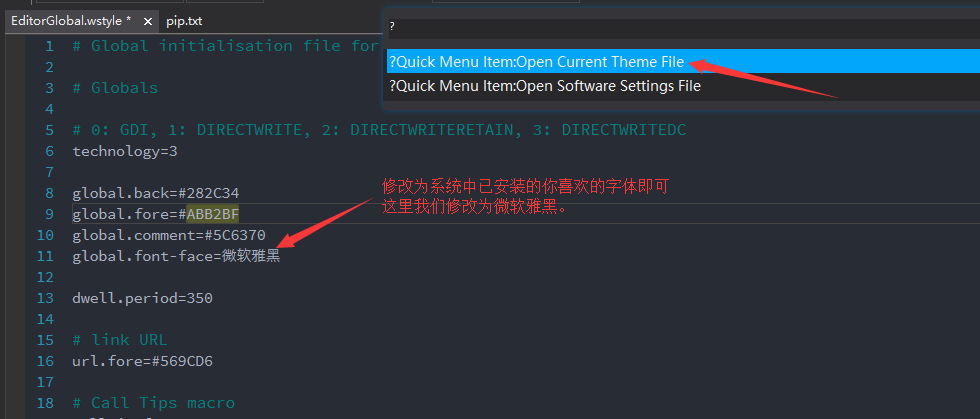

x-studio365 - 代码编辑篇
========================

-------------------
1. 代码编辑功能概览
-------------------

* **支持自动识别UTF-8、GBK等编码, 没有vs、vsc、xcode、as之流带来的乱码烦恼**
* 支持自动识别换行符
* 支持多种字符编码转换
* 支持Ctrl+P快速搜索工程文件
* 支持Ctrl+R快速搜索当前代码文件所有函数
* 支持Ctrl+F当前文档查找，可查找全部匹配项
* 支持Ctrl+H当前文档替换功能
* 支持Ctrl+Shift+F全工程文件内容搜索，搜索支持正则表达式
* 支持在任意目录下文件内容搜索, 工程中可右键资源视图快捷搜索某个目录
* 支持Ctrl+Tab快速切换最近打开文件列表
* 支持Ctrl+-/Ctrl+Shift+-前后导航功能
* 支持Ctrl+F2更改当前文档所有匹配项
* 支持Ctrl+D加选下一匹配项
* 支持Alt+鼠标块选文本
* 支持代码自动完成
* 支持Ctrl+I格式化Lua代码，选中代码或当前文档代码
* 支持Ctrl+B调用 `luacheck <https://github.com/mpeterv/luacheck>`_ 对Lua代码进行静态分析
* 支持Ctrl+/注释Lua代码
* 支持以二进制Ascii视图查看二进制文件
* **支持快速打开和保存100M左右的大文件**
* 内置5种代码主题，通过Ctrl+Alt+Num9进行切换
* 集成Clang-Format-9.0, 可通过快捷键Ctrl+I格式化C++,Java等代码
* 高性能的输出窗口，输出窗口支持过滤
* 支持自定义命令工具配置，命令工具执行日志将被直接捕获到输出窗口
* 支持根据luacheck警告、msvc编译错误、android ndk编译错误等信息在输出窗口快速定位文件

---------------------
2. 修改代码编辑器字体
---------------------
软件默认代码编辑器字体是 ``Source Code Pro``, 如果不喜欢可以通过快捷键 ``Ctrl+Shift+P`` 打开快捷命令对话框，然后选择Open Current Theme File打开
当前代码主题配置文件，找到 ``global.font-face`` ， 修改字体后保存，再通过 ``Ctrl+Alt+Num9`` 重新选择当前代码主题即可，如图所示：

|figure_1|

