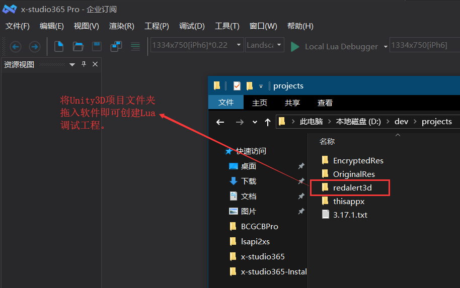
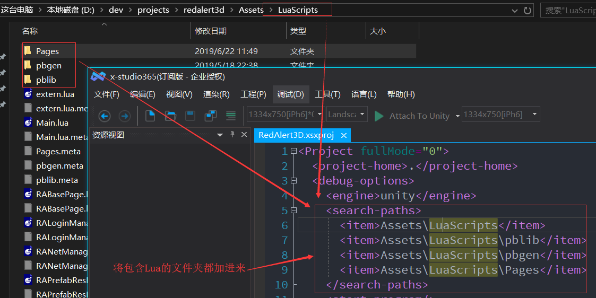
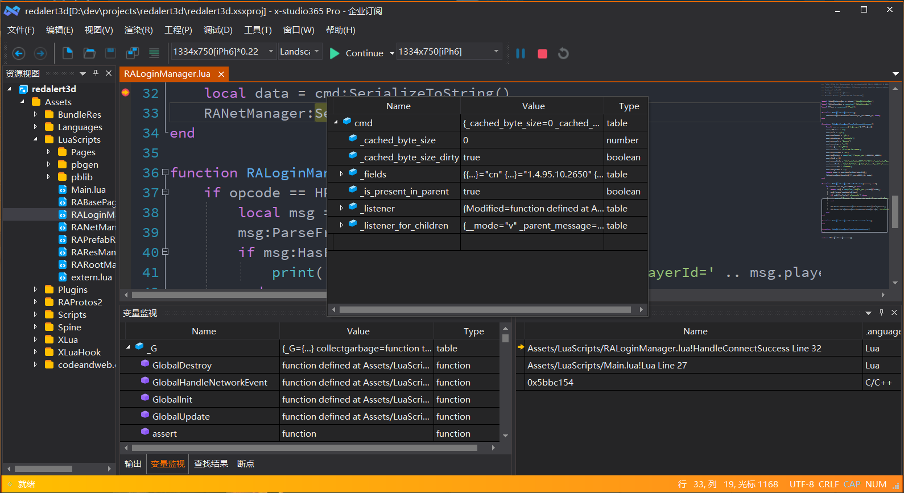

Unity3D Lua调试
=============================

.. note:: Unity Lua调试方式是附加到Unity进程，和VS调试Unity C#类似, xLua,slua,tolua通用

-----------
基本步骤
-----------
1.1.1. 新建工程

  将Unity3D项目文件拖入编辑器即可，如图所示：
  |figure_1|

1.1.2. 启动调试

  通过以上2步 Unity3D Lua调试工程就创建成功了，再次打开.xsxproj工程，按F9打断点，由于软件会 **自动识别Unity工程**,
  因此按F5会直接附加到Unity进程，Unity编辑器中启动预览游戏，命中断点后可查看调用堆栈，鼠标悬浮变量监视，
  或者将变量拖入变量监视窗口，也可以按Shift+F9打开快速监视对话框，如图所示：

  |figure_2|

  |figure_3|

------------
注意事项
------------
* 目前附加到Unity进程后，退出软件会结束Unity进程，请谨慎操作，后续软件更新会专注优化这个体验。

