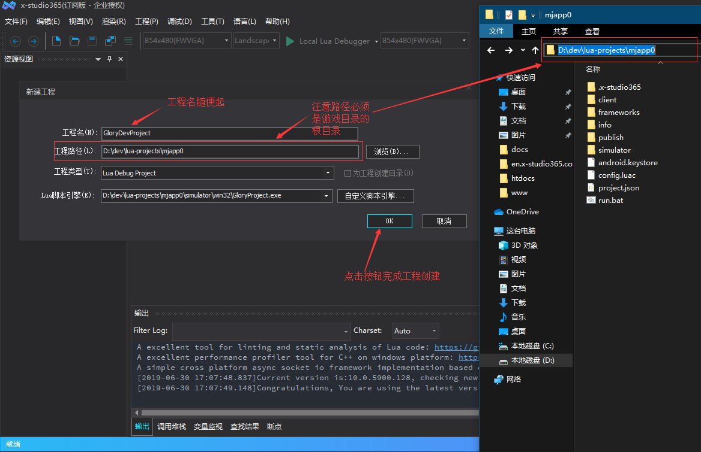
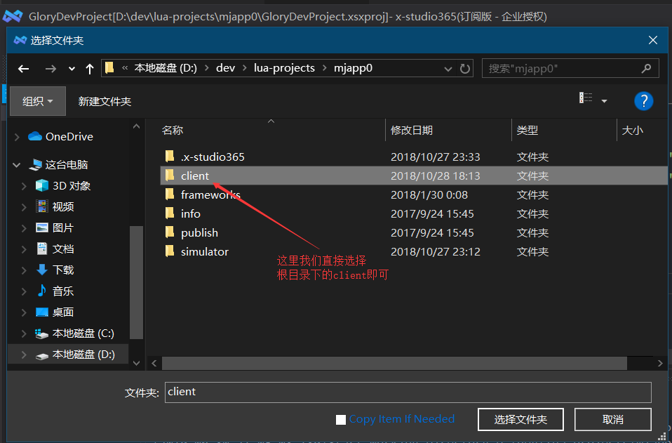
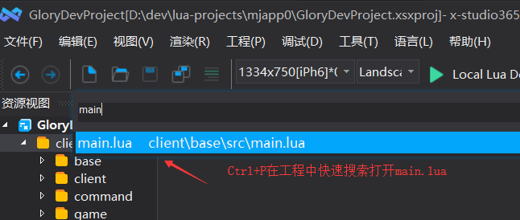

x-studio365 - Cocos2d-x Lua调试
===============================

----------
基本步骤
----------

1. 新建工程

  通过软件主菜单【文件】【新建工程】，在弹出的新建工程对话框中，工程类型设置为Lua Debug, 然后点【自定义引擎脚本…】按钮，选择游戏exe，
  工程路径请选择cocos项目的根目录，工程名随便起一个，例如GloryDevProject，注意：10.0.5900.11及以下，选择exe后会默认将工程目录设置exe所在目录下，
  请务必将工程路径改为项目的根目录，如下图所示：|figure_1|

2. 添加代码文件夹

  点击对话框【确定】按钮，调试工程就创建好了。为了在开发过程中能快速打开Lua代码文件，先将项目Lua代码文件添加进来，在资源视图右键菜单【添加文件夹】进行添加，如图所示
  |figure_2a| |figure_2b|

3. 配置调试参数

  通过软件菜单【调试】【调试设置】打开调试设置对话框，修改工作目录为client, 设置调试 参数为:
  ``-workdir $(ProjectDir)client -file $(ProjectDir)client/base/src/main.lua``,
  点击保存工程按钮，保存调试工程，下次可在最近工程中打开，如图所示：
  |figure_3|

4. 启动调试

  通过以上3步，项目的Lua调试工程就创建成功了，
  用快捷键Ctrl+P搜索项目文件打开main.lua，按F9打断点，按F5启动调试，
  命中断点后，可查看调用堆栈，将需要监视值得变量拖入变量监视窗口，调试操作
  及快捷键和VisualStudio完全一致，如图所示：
  |figure_4a| |figure_4b|

------------------
注意事项
------------------

* 如果通过以上设置后，启动调试游戏闪退，请尝试删除exe同目录下的.dcache后缀文件后再重试

.. |figure_2a| image:: ../img/c2s1_02a.png

.. |figure_3| image:: ../img/c2s1_03.png

.. |figure_4b| image:: ../img/c2s1_04b.png

