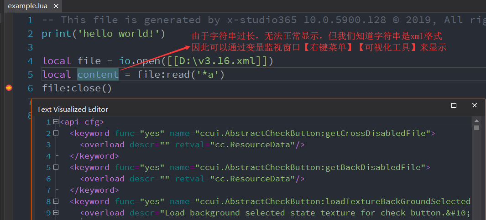

x-studio365 - Lua调试篇
=======================

.. note:: 调试过程中，如果将纯Lua函数拖入变量监视窗口，则可在变量监视窗口双击跳转到函数定义。

.. note:: 对于早期Cocos2d-x引擎及Visual Studio 2013的项目，默认采用的是静态链接Lua库的方式,所以第一次启动调试会慢,之后启动调试就很快了(这是软件会对所有Lua API函数地址作符号缓存的效果)直至下次exe发生变化, 因此建议始终使用动态Lua库的方式，
 使用动态Lua库的好处有:

 (1)任何时候都可以快速启动调试，即使exe发生变化；

 (2)可以调试无调试符号的Release版本exe。

.. note:: 变量监视过程中查看大字符串或者具有特定格式的字符串，例如json, xml等特定格式字符串，
 可在变量监视窗口右键菜单【可视化工具】的弹出菜单选择相应格式预览完整字符串，如图所示：
 |figure_1|

.. toctree::
    :maxdepth: 2
    :numbered: 2

    01_unity3d
    02_cclua
    03_olua

